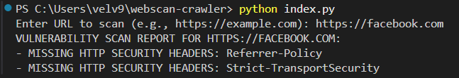

# webscan-crawler

## PROJECT DESCRIPTION
Build a simple web crawler that can visit a website and scan for basic vulnerabilities. For simplicity, let the crawler check for a few common issues, such as:
1. Presence of HTTP security headers (e.g., X-Content-Type-Options, Strict-TransportSecurity).
2. Presence of outdated software versions (if visible on the webpage or headers).
3. Presence of forms without security attributes (e.g., action attribute missing or method="GET" instead of POST).

## STEPS TO RUN THE CODE:
1. git clone https://github.com/pratishma09/webscan-crawler.git
2. cd webscan-crawler
3. Run pip install requests beautifulsoup4
4. python index.py
5. Enter the full url in format: https://example.com

## Assumptions:
1. Presence of HTTP security headers (e.g., X-Content-Type-Options, Strict-TransportSecurity).
2. Presence of outdated software versions (if visible on the webpage or headers).
3. Presence of forms without security attributes (e.g., action attribute missing or method="GET" instead of POST).

## Limitations:
1. Takes longer time as crawls through multiple internal links.
2. Static analysis

## Sample Output:

## REFERENCES:
https://www.zenrows.com/blog/web-crawler-python#follow-all-links-on-website